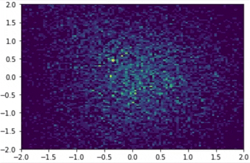

# Normalizing Flows in JAX

<a href="https://circleci.com/gh/ChrisWaites/jax-flows">
    
</a>
<a href="https://github.com/ChrisWaites/jax-flows/blob/master/LICENSE">
    
</a>
<a href="https://jax-flows.readthedocs.io/en/latest/">
    
</a>

<p>Implementations of normalizing flows (RealNVP, Glow, MAF) in the <a href="https://github.com/google/jax/">JAX</a> deep learning framework.</p>

## What are normalizing flows?

[Normalizing flow models](http://akosiorek.github.io/ml/2018/04/03/norm_flows.html) are _generative models_, i.e. they infer the underlying probability distribution of an observed dataset. With that distribution we can do a number of interesting things, namely sample new realistic points and query probability densities.

## Why JAX?

A few reasons!

1) JAX encourages a functional style. When writing a layer, I didn't want people to worry about PyTorch or TensorFlow boilerplate and how their code has to fit into "the system" (e.g. do I have to keep track of `self.training` here?) _All_ you have to worry about is writing a vanilla python function which, given an ndarray, returns the correct set of outputs. You could develop your own layers with effectively no knowledge of the encompassing framework.

2) JAX's [random number generation system](https://github.com/google/jax/blob/master/design_notes/prng.md) places reproducibility first. To get a sense for this, when you start to parallelize a system, centralized state-based models for PRNG a la `torch.manual_seed()` or `tf.random.set_seed()` start to yield inconsistent results. Given that randomness is such a central component to work in this area, I thought that uncompromising reproducibility would be a nice feature.

3) JAX has a really flexible automatic differentiation system. So flexible, in fact, that you can (basically) write arbitrary python functions (including for loops, if statements, etc.) and automatically compute their jacobian with a call to `jax.jacfwd`. So, in theory, you could write a normalizing flow layer and automatically compute its jacobian's log determinant without having to do so manually (although we're not quite there yet).

## How do things work?

Here's an introduction! But for a more comprehensive description, check out the [documentation](https://jax-flows.readthedocs.io/).

### Bijections

A `bijection` is a parameterized invertible function.

```python
init_fun = flows.InvertibleLinear()

params, direct_fun, inverse_fun = init_fun(rng, input_dim=5)

# Transform inputs
transformed_inputs, log_det_jacobian_direct = direct_fun(params, inputs)

# Reconstruct original inputs
reconstructed_inputs, log_det_jacobian_inverse = inverse_fun(params, transformed_inputs)

assert np.array_equal(inputs, reconstructed_inputs)
```

We can construct a sequence of bijections using `flows.Serial`. The result is just another bijection, and adheres to the exact same interface.

```python
init_fun = flows.Serial(
    flows.AffineCoupling()
    flows.InvertibleLinear(),
    flows.ActNorm(),
)

params, direct_fun, inverse_fun = init_fun(rng, input_dim=5)
```

### Distributions

A `distribution` is characterized by a probability density querying function, a sampling function, and its parameters.

```python
init_fun = flows.Normal()

params, log_pdf, sample = init_fun(rng, input_dim=5)

# Query probability density of points
log_pdfs = log_pdf(params, inputs)

# Draw new points
samples = sample(rng, params, num_samples)
```

### Normalizing Flow Models

Under this definition, a normalizing flow model is just a `distribution`. But to retrieve one, we have to give it a `bijection` and another `distribution` to act as a prior.

```python
bijection = flows.Serial(
    flows.AffineCoupling(),
    flows.InvertibleLinear(),
    flows.ActNorm()
    flows.AffineCoupling(),
    flows.InvertibleLinear(),
    flows.ActNorm()
)

prior = flows.Normal()

init_fun = flows.Flow(bijection, prior)

params, log_pdf, sample = init_fun(rng, input_dim=5)
```

### How do I train a model?

The same as you always would in JAX! First, define an appropriate loss function and parameter update step.

```python
def loss(params, inputs):
    return -log_pdf(params, inputs).mean()

@jit
def step(i, opt_state, inputs):
    params = get_params(opt_state)
    gradient = grad(loss)(params, inputs)
    return opt_update(i, gradient, opt_state)
```

Then execute a standard JAX training loop.

```python
batch_size = 32
itercount = itertools.count()
for epoch in range(num_epochs):
    npr.shuffle(X)
    for batch_index in range(0, len(X), batch_size):
        opt_state = step(
            next(itercount),
            opt_state,
            X[batch_index:batch_index+batch_size]
        )

optimized_params = get_params(opt_state)
```

Now that we have our trained model parameters, we can query and sample as regular.

```python
log_pdfs = log_pdf(optimized_params, inputs)

samples = sample(rng, optimized_params, num_samples)
```

_Magic!_

## Interested in contributing?

Yay! Check out our [contributing guidelines](https://github.com/ChrisWaites/jax-flows/blob/master/.github/CONTRIBUTING.md).

## Inspiration

This repository is largely modeled after the [`pytorch-flows`](https://github.com/ikostrikov/pytorch-flows) repository by [Ilya Kostrikov](https://github.com/ikostrikov), the [`nf-jax`](https://github.com/ericjang/nf-jax) repository by [Eric Jang](http://evjang.com/), and the [`normalizing-flows`](https://github.com/tonyduan/normalizing-flows) repository by [Tony Duan](https://github.com/tonyduan).

The implementations are modeled after the work of the following papers:

  > [NICE: Non-linear Independent Components Estimation](https://arxiv.org/abs/1410.8516)\
  > Laurent Dinh, David Krueger, Yoshua Bengio\
  > _arXiv:1410.8516_

  > [Density estimation using Real NVP](https://arxiv.org/abs/1605.08803)\
  > Laurent Dinh, Jascha Sohl-Dickstein, Samy Bengio\
  > _arXiv:1605.08803_

  > [Improving Variational Inference with Inverse Autoregressive Flow
](https://arxiv.org/abs/1606.04934)\
  > Diederik P. Kingma, Tim Salimans, Rafal Jozefowicz, Xi Chen, Ilya Sutskever, Max Welling\
  > _arXiv:1606.04934_

  > [Glow: Generative Flow with Invertible 1x1 Convolutions](https://arxiv.org/abs/1807.03039)\
  > Diederik P. Kingma, Prafulla Dhariwal\
  > _arXiv:1807.03039_

  > [Flow++: Improving Flow-Based Generative Models
  with Variational Dequantization and Architecture Design](https://openreview.net/forum?id=Hyg74h05tX)\
  > Jonathan Ho, Xi Chen, Aravind Srinivas, Yan Duan, Pieter Abbeel\
  > _OpenReview:Hyg74h05tX_

  > [Masked Autoregressive Flow for Density Estimation](https://arxiv.org/abs/1705.07057)\
  > George Papamakarios, Theo Pavlakou, Iain Murray\
  > _arXiv:1705.07057_

  > [Neural Spline Flows](https://arxiv.org/abs/1906.04032)\
  > Conor Durkan, Artur Bekasov, Iain Murray, George Papamakarios\
  > _arXiv:1906.04032_

And by association the following surveys:

  > [Normalizing Flows: An Introduction and Review of Current Methods](https://arxiv.org/abs/1908.09257)\
  > Ivan Kobyzev, Simon Prince, Marcus A. Brubaker\
  > _arXiv:1908.09257_

  > [Normalizing Flows for Probabilistic Modeling and Inference](https://arxiv.org/abs/1912.02762)\
  > George Papamakarios, Eric Nalisnick, Danilo Jimenez Rezende, Shakir Mohamed, Balaji Lakshminarayanan\
  > _arXiv:1912.02762_

