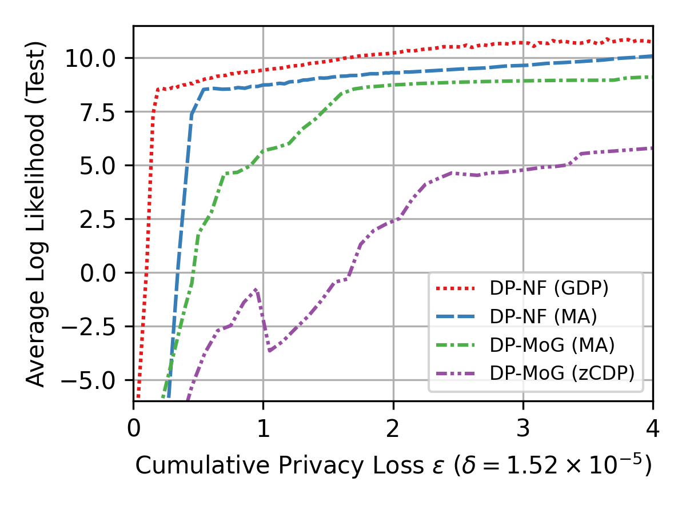

# Differentially Private Normalizing Flows for Privacy-Preserving Density Estimation

This repository is the official implementation of _Differentially Private Normalizing Flows for Privacy-Preserving Density Estimation_.

Our method currently achieves state-of-the-art performance on a number of density estimation benchmarks, solving simultaneous likelihood estimation and synthetic data generation while preserving privacy under the notion of [differential privacy](https://en.wikipedia.org/wiki/Differential_privacy).

If you use this software, please cite:

```python
@inproceedings{dpflows,
  title={Differentially Private Normalizing Flows for Privacy-Preserving Density Estimation},
  author={Waites, Chris and Cummings, Rachel},
  year={2020}
}
```

## Requirements

Python version:

```
Python >= 3.7
```

To install requirements:

```setup
pip install -r requirements.txt
```

This repository relies on the [JAX](https://github.com/google/jax) deep learning framework. The dependencies include a default installation of Jax prepared for CPU, but if you would like to run things on GPU, refer to the [JAX installation guide](https://github.com/google/jax#installation) for installing an appropriate version for your machine.

Assuming you have a relatively normal setup (e.g. Amazon AWS EC2 with Nvidia GPU and Python 3.7), the command you run will probably look something like this:

```
pip install --upgrade https://storage.googleapis.com/jax-releases/cuda110/jaxlib-0.1.55-cp37-none-manylinux2010_x86_64.whl
```

## Datasets

Relevant datasets should be given, including:

- [Preprocessed Life Science dataset](./datasets/lifesci)

## Training

Training parameters and configuration can be found in `experiment.ini`.

To train the model(s) in the paper, run this command:

```train
python train.py
```

## Pre-trained Models

You can download pretrained models here:

- [Pretrained Models](https://drive.google.com/drive/folders/1YCZLjNyL6c1iOPATbwWUmI1D8KDp0RNT?usp=sharing)

Simply place the `out` directory in the root of this repository.

## Evaluation

To evaluate my model on the Life Science dataset, run:

```eval
python analysis/print_likelihoods.py
```

The code for our baseline can be found [here](https://github.com/mijungi/dpem_code).

